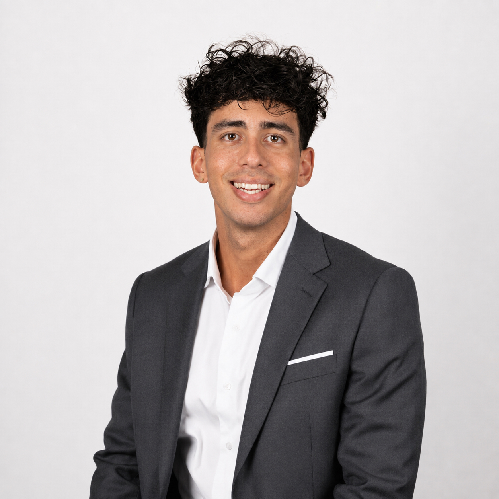

::::: {.hero}
:::: {.hero-left}
{.hero-photo fig-alt="Yoann Pull"}

  <a href="CV_Yoann_Pull.pdf" target="_blank" rel="noopener">📄 CV</a>
  <a href="https://scholar.google.com/citations?user=lmJQgZsAAAAJ&hl=en" target="_blank" rel="noopener">🎓 Scholar</a>
  <a href="https://www.linkedin.com/in/yoann-pull/" target="_blank" rel="noopener">in LinkedIn</a>
  <a href="https://github.com/YoannPull" target="_blank" rel="noopener">GitHub</a>

::::

:::: {.hero-right}

 Visiting Student Researcher · Stanford Statistics · Fall 2026

Yoann Pull

PhD Candidate in Economics

Laboratoire d'Économie d'Orléans · Square Management

I develop econometric and statistical methods for measuring, monitoring, and stress-testing financial risk.

::::
:::::

::: {.about}

## About

My research lies at the intersection of financial econometrics and statistical inference, with applications to credit risk, model validation, and stress testing. I develop econometric, Bayesian, and sequential methods for measuring and monitoring financial risks, including those arising from geopolitical and climate-related shocks.

I am a PhD candidate in Economics at the [Laboratoire d'Économie d'Orléans (LEO)](https://www.leo-univ-orleans.fr/en/){target="_blank" rel="noopener"}, University of Orléans, and a research scientist at [Square Management](https://www.square-management.com/){target="_blank" rel="noopener"} through the French CIFRE programme, working under the supervision of [Professor Christophe Hurlin](https://sites.google.com/view/christophe-hurlin/home){target="_blank" rel="noopener"}. At Square Management I conduct research and advisory work for banking institutions on probability-of-default calibration, model validation, and stress testing.

From September to December 2026, I will be a **Visiting Student Researcher** in the [Department of Statistics at Stanford University](https://statistics.stanford.edu/){target="_blank" rel="noopener"}, hosted by [Professor Aaditya Ramdas](https://web.stanford.edu/~aramdas/){target="_blank" rel="noopener"}, working on sequential and anytime-valid inference.

<strong>Research interests:</strong> financial econometrics · credit risk · model validation · stress testing · Bayesian inference · sequential inference · emerging risks.

:::

::: {.news}

## News

Sep 2026

Starting a research visit at the <strong>Department of Statistics, Stanford University</strong>, hosted by Professor Aaditya Ramdas.

Jun 2026

Presenting at the <strong>18th Annual SoFiE Conference</strong>, University of Macau.

2026

Our paper on Bayesian probability-of-default calibration was <strong>accepted at the European Journal of Operational Research</strong>.

Mar 2026

Presented at the <strong>19th Financial Risks International Forum</strong>, Institut Louis Bachelier, Paris.

Nov 2025

Research seminar at the <strong>Laboratoire d'Économie d'Orléans</strong>, University of Orléans.

:::
